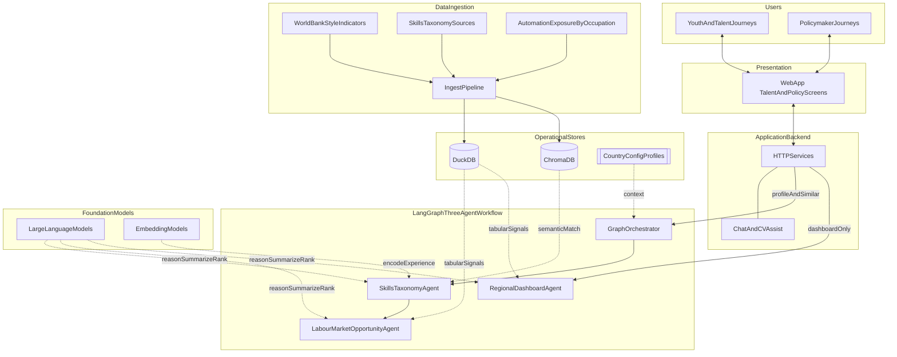

# UNMAPPED — AI Skills Infrastructure for Youth

> Closing the distance between real skills and economic opportunity in LMICs.
> World Bank Youth Summit · HackNation 5

#### tech video - https://youtu.be/EMvrc_ccMWU
#### demo video - https://www.youtube.com/watch?v=D8FYljYJSU4
---

## Architecture

- Offline **ingestion** loads public benchmarks and taxonomy into **DuckDB** (tabular) and **ChromaDB** (vectors).
- Online path: **Next.js UI** talks to backend **HTTP + chat/CV helpers**.
- **LangGraph** (LangChain-style) runs three agents **in sequence** for talent: orchestrator → **skills taxonomy** → **labour-market opportunities**.
- **Dashboard agent** is invoked **directly** for policymaker-heavy views (bypasses the full talent chain when appropriate).
- **Country profiles** (YAML-style config) steer behaviour without altering stored embeddings.
- **LLMs** and **embedding models** sit behind all three agents; provider is **swappable**.



**Data → agents**

- **ChromaDB** → semantic match for **skills taxonomy** agent (+ embedding model for queries).
- **DuckDB** → indicators, wages, aggregates for **opportunity** and **dashboard** agents.
- **Profiles** → context into **orchestrator** only (talent workflow).
- Ingestion is **batch** / admin-triggered, not per user click.

---

## Setup

### 1. Clone and install

```bash
git clone <repo>
cd hacknation5

# Backend
python -m venv venv
source venv/bin/activate   # Windows: venv\Scripts\activate
pip install -r requirements.txt

# Frontend
cd frontend && npm install
```

### 2. Set your Gemini API key

```bash
cp .env.example .env
# Edit .env and set: GEMINI_API_KEY=your_key_here
```

Get a free key at: https://aistudio.google.com/app/apikey

### 3. Download ESCO skills CSV (one-time)

1. Go to https://esco.ec.europa.eu/en/use-esco/download
2. Choose: **ESCO v1.2.1 → CSV → Skills → English**
3. Save the file as `data/skills_en.csv`

### 4. Run data ingestion

```bash
# Pull ILOSTAT + World Bank + Frey-Osborne + embed ESCO
python run.py ingest

# If ESCO CSV not downloaded yet, skip it:
python run.py ingest-no-esco
```

This populates `data/unmapped.duckdb` and `data/chroma/`.

### 5. Start the backend

```bash
python run.py serve
# API running at http://localhost:8000
# Docs at http://localhost:8000/docs
```

### 6. Start the frontend

```bash
cd frontend
npm run dev
# App at http://localhost:3000
```

---

## Endpoints

| Method | Path | Description |
|--------|------|-------------|
| `POST` | `/api/profile` | Submit youth profile → Skills Passport + Opportunities |
| `GET`  | `/api/opportunities` | Re-fetch opportunities for saved profile |
| `GET`  | `/api/dashboard?country_code=GHA` | Policymaker econometric dashboard |
| `POST` | `/api/ingest` | Trigger data ingestion (admin) |
| `GET`  | `/api/configs` | List available country configs |
| `GET`  | `/api/health` | Health check |

### Example: Submit profile

```bash
curl -X POST http://localhost:8000/api/profile \
  -H "Content-Type: application/json" \
  -d '{
    "education_level": "Senior high school (SHS) / Secondary",
    "experience_text": "I have repaired smartphones for 5 years and taught basic coding to students.",
    "country_code": "GHA"
  }'
```

---

## Country config

Country contexts live in `config/`. Switch countries without changing code:

```yaml
# config/ghana.yaml
country_code: GHA
country_name: Ghana
automation_calibration:
  digital_adjustment_factor: 0.65
opportunity_modes: [formal_job, self_employment, gig, training]
```

Add a new country by creating `config/xyz.yaml` and re-running ingestion.

---

## Project structure

```
hacknation5/
├── config/
│   ├── ghana.yaml
│   └── bangladesh.yaml
├── data/               ← created by ingestion (gitignored)
│   ├── unmapped.duckdb
│   ├── chroma/
│   └── skills_en.csv   ← download manually
├── backend/
│   ├── agents/
│   │   ├── skills_agent.py
│   │   ├── opportunity_agent.py
│   │   └── dashboard_agent.py
│   ├── rag/
│   │   ├── chroma_store.py
│   │   └── duckdb_store.py
│   ├── ingestion/
│   │   ├── fetch_ilostat.py
│   │   ├── fetch_worldbank.py
│   │   ├── load_frey_osborne.py
│   │   └── embed_esco.py
│   ├── orchestrator.py
│   └── api/main.py
├── frontend/
│   ├── app/
│   │   ├── page.tsx            ← youth form
│   │   ├── results/page.tsx    ← skills passport + opportunities
│   │   └── dashboard/page.tsx  ← policymaker view
│   └── lib/api.ts
├── requirements.txt
├── run.py
└── .env.example
```

---

## Demo: Country-agnostic requirement

Run the same profile with Ghana then Bangladesh:

```bash
# Ghana
curl -X POST http://localhost:8000/api/profile \
  -d '{"education_level":"Secondary","experience_text":"phone repair, 5 years","country_code":"GHA"}'

# Bangladesh — same profile, different wage signals + opportunity ranking
curl -X POST http://localhost:8000/api/profile \
  -d '{"education_level":"Secondary","experience_text":"phone repair, 5 years","country_code":"BGD"}'
```

No code changes — only `country_code` differs.
