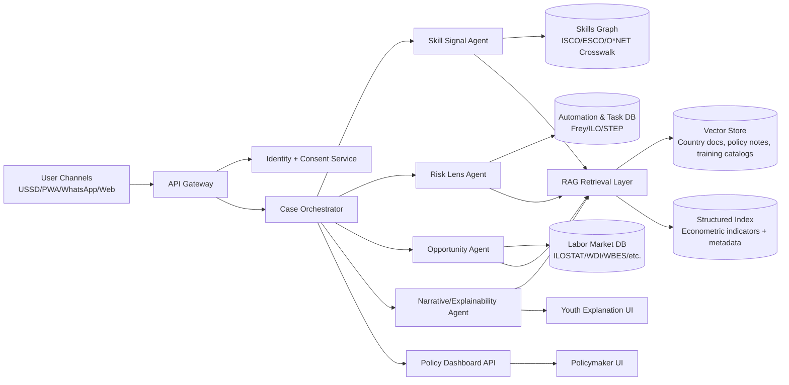

# UNMAPPED — AI-Native, Country-Agnostic Skills Infrastructure

## 1) Design goals pulled from challenge brief

This architecture is designed to satisfy all core constraints in `todo.txt`:
- Infrastructure layer (not one-off app): configurable by government/NGO/employer.
- Country-agnostic: no hardcoded labor taxonomies, language, or risk calibration.
- Human-readable and explainable outputs for youth users with low digital literacy.
- Low-bandwidth, shared-device friendly operation.
- Real econometric grounding with visible signals, not hidden model-only logic.
- Supports at least 2 challenge modules (this design implements all 3).

---

## 2) High-level architecture



---

## 3) Agentic system design

### A. Core multi-agent roles

1. **Intake & Profile Agent**
   - Collects education, informal experience, portfolio evidence, language preference.
   - Normalizes raw input into canonical profile schema.
   - Handles missing/incomplete credentials (confidence tags per field).

2. **Skills Signal Agent**
   - Maps evidence to standardized skill entities (ISCO/ESCO/O*NET aligned).
   - Produces:
     - Portable machine-readable profile (`JSON-LD` or Open Badges compatible)
     - Human-readable “skills passport” summary.
   - Emits explainability trace: “why this skill was inferred”.

3. **AI Readiness & Displacement Agent**
   - Computes task-level exposure from real datasets (Frey-Osborne + ILO task indices + STEP where available).
   - Calibrates by local digital readiness (ITU connectivity, local infrastructure proxies).
   - Outputs:
     - At-risk tasks
     - Durable skills
     - Adjacent resilience skills and training recommendations.

4. **Opportunity Matching Agent**
   - Matches profile against realistic opportunities:
     - Formal jobs
     - Self-employment pathways
     - Gig work
     - Training tracks.
   - Uses constraint-aware ranking (location, required credential gap, wage floor, device/connectivity limitations).

5. **Econometrics Narrator Agent**
   - Converts data signals into plain language for youth and policymakers.
   - Forces explicit display of at least two visible indicators, e.g.:
     - Sector wage floor
     - Employment growth rate
     - Return to education level.

6. **Localization Agent**
   - Runtime translation/localization of UI and explanations.
   - Adapts vocabulary to local terms (occupation labels, credential names).

7. **Governance & Safety Agent**
   - PII redaction, consent enforcement, bias checks, hallucination guardrails.
   - Blocks unsupported recommendations when confidence is low.

### B. Orchestration pattern

- Use a **planner-executor** pattern:
  - Planner decides which agents are required per request.
  - Executor invokes agents with shared context object.
- Store every agent output as a signed event (audit trail).
- Include confidence + data lineage with each recommendation.

---

## 4) RAG architecture

### A. Why hybrid RAG (not only vectors)

Challenge requires econometric transparency and configuration by country. Pure vector search is insufficient. Use:
- **Vector retrieval** for unstructured text (policy notes, local training descriptions).
- **Structured retrieval** for numeric indicators and taxonomy joins.

### B. Knowledge stores

1. **Vector Store**
   - Embedded documents:
     - Country labor reports
     - NGO training catalogs
     - Local opportunity bulletins
     - Program eligibility rules.

2. **Relational/Warehouse store**
   - Time-series and panel data:
     - ILOSTAT, WDI, WBES, GLD, ITU, Wittgenstein projections.
   - Precomputed feature tables:
     - occupation × country × year risk scores
     - wage floor by sector/region
     - growth indicators.

3. **Skills Knowledge Graph**
   - Node types: occupations, skills, tasks, credentials, training modules.
   - Edges: `requires`, `adjacent_to`, `maps_to`, `improves_resilience_for`.

### C. Retrieval pipeline

1. Detect intent (`profile`, `risk`, `opportunity`, `policy-dashboard`).
2. Build retrieval plan:
   - structured query for required indicators.
   - vector query for contextual explanations.
3. Ground generation with citations + data timestamp.
4. Apply answer contract:
   - include 2+ econometric signals visibly
   - include confidence band
   - include “what this does NOT know”.

---

## 5) Data pipeline (country-configurable)

### A. ETL/ELT layers

- **Ingestion connectors**: ILOSTAT, WDI, Wittgenstein, UNESCO UIS, ITU, STEP, Frey-Osborne source files.
- **Normalization service**: harmonize sector/occupation codes into canonical internal schema.
- **Crosswalk engine**: ISCO ↔ ESCO ↔ O*NET mapping tables.
- **Calibration jobs**:
  - adjust automation risk by local infrastructure/digital penetration
  - adjust recommendation feasibility by local opportunity types.

### B. Config-first model

All country and context variation is in config, not code:

```yaml
country_profile:
  country_code: GHA
  languages: ["en", "tw"]
  scripts: ["latin"]

labor_market:
  source: "ILOSTAT"
  sector_taxonomy: "ISIC4"
  wage_indicator: "median_monthly_wage_local"

education:
  taxonomy: "ISCED"
  credential_mapping_file: "mappings/gha_isced_credentials.csv"

automation_calibration:
  base_model: "frey_osborne"
  adjustment_features: ["internet_penetration", "electricity_reliability", "firm_digital_adoption"]

opportunity_modes:
  enabled: ["formal_job", "self_employment", "gig", "training"]

ui_localization:
  default_language: "en"
  plain_language_level: "A2"
```

---

## 6) Module implementation blueprint (maps to challenge modules)

### Module 1 — Skills Signal Engine

**Input**: education, work stories, artifacts, references.

**Pipeline**:
1. Evidence extraction (LLM + rule parser).
2. Skill mapping via taxonomy graph.
3. Confidence scoring + explainability generation.
4. Produce portable skills passport.

**Output views**:
- Youth: “You can do X, Y, Z; evidence came from A, B.”
- Employer/provider API: standardized machine-readable profile.

### Module 2 — AI Readiness & Displacement Risk Lens

**Input**: skills passport + local context profile.

**Pipeline**:
1. Map current work to occupation-task matrix.
2. Join task exposure datasets.
3. Run local calibration layer.
4. Generate resilience pathways.

**Output views**:
- Risk heatmap by task (not just occupation).
- Durable skill list.
- Adjacent skills with estimated effort and local relevance.

### Module 3 — Opportunity Matching + Econometric Dashboard

**Input**: profile + location + opportunity mode preferences.

**Pipeline**:
1. Candidate opportunity retrieval (jobs/training/gig/self-employment).
2. Feasibility filtering (distance, credential gap, device constraints).
3. Econometric scoring (wage floor, growth, returns to education).
4. Explainable ranking.

**Output views**:
- Youth feed with realistic opportunities.
- Policymaker dashboard with aggregate demand/supply mismatch and subgroup trends.

---

## 7) APIs (minimal contract)

- `POST /v1/profile/ingest`
- `GET /v1/profile/{id}/passport`
- `POST /v1/risk/assess`
- `POST /v1/opportunity/match`
- `GET /v1/dashboard/econometrics?country=...&segment=...`
- `POST /v1/config/context` (country/localization/taxonomy sources)

Response contract includes:
- `explanations[]`
- `econometric_signals[]`
- `confidence_score`
- `data_lineage[]`
- `limitations[]`

---

## 8) UX for low-resource constraints

- Offline-first PWA with background sync.
- SMS/USSD-lite intake flow for profile bootstrap.
- Progressive disclosure: short explanations first, details optional.
- Shared device mode: PIN + ephemeral session.
- Audio summary option in local language for low literacy.

---

## 9) Trust, ethics, and governance

- Explicit user consent and revocable data sharing.
- Bias diagnostics by gender/region/education level.
- No deterministic exclusion decisions; recommendations remain advisory.
- Human navigator override channel (NGO counselor can annotate).
- Model cards + data cards shown in admin dashboard.

---

## 10) Deployment reference

- **Frontend**: PWA + optional WhatsApp bot.
- **Backend**: Python FastAPI microservices.
- **Data**: Postgres + DuckDB/BigQuery + vector DB (e.g., pgvector).
- **Orchestration**: Temporal/Celery for pipelines.
- **MLOps**: scheduled recalibration jobs and drift monitors.
- **Hosting**: modular; deployable per-country tenancy.

---

## 11) Demo plan for “country-agnostic requirement”

1. Demo Context A: Ghana urban informal economy.
2. Switch config to Context B: Bangladesh rural/agri.
3. Re-run same profile and show changed:
   - risk calibration
   - opportunity type ranking
   - language and credential mapping
   - econometric indicators.

No code changes; only config and data connectors differ.

---

## 12) MVP in 2-week hackathon scope

### Week 1
- Build profile intake + skills passport.
- Add one risk pipeline (Frey + ITU adjustment).
- Integrate 2 econometric signals (wage floor + sector growth).

### Week 2
- Add opportunity matching and dual dashboards.
- Add one localization switch + one context switch demo.
- Add explainability and limitations panel.

---

## 13) Success metrics

- `% profiles with explainable skill mapping`
- `median time from intake to first realistic opportunity`
- `% recommendations with 2+ visible econometric signals`
- `cross-context portability score` (same profile, different context outputs)
- `user trust score` (self-reported understanding + perceived fairness)

---

## 14) Suggested stack for hackathon implementation

- LLM orchestration: LangGraph / Semantic Kernel
- Embeddings: multilingual model (e.g., `text-embedding-3-large` or equivalent)
- Vector DB: pgvector (simple), Weaviate/Pinecone (managed)
- BI dashboard: Metabase/Superset for policy view
- Frontend: Next.js PWA + i18n
- Data transformations: dbt + Python notebooks

This gives a practical path to prototype quickly while preserving long-term extensibility.

---

## 15) Complete End-to-End Technical Flowchart

```mermaid
flowchart TD
    %% =========================
    %% INPUT LAYER
    %% =========================
    subgraph IN[Input Layer]
      U1[Youth Input\nEducation, informal work, language, location]
      U2[Navigator/NGO Input\nAssessment notes, references]
      U3[Employer/Provider Input\nVacancies, training offerings]
      U4[Policy Input\nCountry config + target segments]

      D1[External Data APIs\nILOSTAT, WDI, WBES, GLD, UNESCO, ITU]
      D2[Taxonomies\nISCO-08, ESCO, O*NET]
      D3[Automation Datasets\nFrey-Osborne, ILO task indices, STEP]
      D4[Projections\nWittgenstein + UN population]
    end

    %% =========================
    %% CHANNEL + ACCESS LAYER
    %% =========================
    subgraph CH[Access Channels]
      C1[PWA/Web App]
      C2[WhatsApp Bot]
      C3[SMS/USSD Lite]
      C4[Program Officer Dashboard]
    end

    %% =========================
    %% PLATFORM EDGE
    %% =========================
    subgraph EDGE[Platform Edge]
      E1[API Gateway]
      E2[Auth + Consent Service]
      E3[Rate Limit + Abuse Protection]
      E4[Session Manager\nShared-device safe mode]
    end

    %% =========================
    %% ORCHESTRATION
    %% =========================
    subgraph ORCH[Agent Orchestration Layer]
      O1[Request Classifier\nprofile/risk/opportunity/policy]
      O2[Planner Agent\nbuild execution plan]
      O3[Executor\ninvoke specialized agents]
      O4[Policy & Guardrails\nPII, bias, confidence rules]
      O5[Audit Logger\ntrace + lineage events]
    end

    %% =========================
    %% CORE AGENTS
    %% =========================
    subgraph AG[Core AI Agents]
      A1[Intake & Profile Agent]
      A2[Skills Signal Agent]
      A3[Risk Lens Agent]
      A4[Opportunity Matching Agent]
      A5[Econometric Narrator Agent]
      A6[Localization Agent]
      A7[Governance & Safety Agent]
    end

    %% =========================
    %% RAG + DATA LAYER
    %% =========================
    subgraph DATA[RAG + Data Platform]
      R1[Hybrid Retriever\nVector + Structured + Graph]
      R2[Feature Store\ncountry-occupation-task features]
      R3[Rules Engine\neligibility + feasibility constraints]

      S1[(Vector Store\npolicy docs, local catalogs)]
      S2[(Warehouse\neconometric indicators time-series)]
      S3[(Skills Graph\nISCO↔ESCO↔O*NET crosswalk)]
      S4[(Operational DB\nprofiles, opportunities, configs)]
      S5[(Model Registry\nrisk model + calibration versions)]
    end

    %% =========================
    %% DATA ENGINEERING
    %% =========================
    subgraph PIPE[Data Engineering Pipelines]
      P1[Ingestion Connectors]
      P2[Normalization\ncode harmonization]
      P3[Crosswalk Builder\noccupation-skill-task mapping]
      P4[Calibration Jobs\nLMIC risk adjustment]
      P5[Quality + Drift Monitoring]
    end

    %% =========================
    %% DECISION PRODUCTS
    %% =========================
    subgraph PROD[Decision Products]
      X1[Skills Passport\nportable + human-readable]
      X2[AI Readiness Report\nrisk tasks + durable skills]
      X3[Opportunity List\nrealistic ranked pathways]
      X4[Econometric Cards\nwage floor, growth, returns to education]
      X5[Policy Dashboard Signals\naggregate mismatches + trends]
      X6[Limitations & Confidence\nknown unknowns + score bands]
    end

    %% =========================
    %% OUTPUT INTERFACES
    %% =========================
    subgraph OUT[Output Interfaces]
      Y1[Youth UI\nplain-language + local language + audio]
      Y2[Navigator UI\naction plan + referral packet]
      Y3[Employer/Provider API\nstandardized profile schema]
      Y4[Policymaker Dashboard\nsegment-level analytics]
      Y5[Exports\nJSON-LD, CSV, PDF]
    end

    %% =========================
    %% FLOW CONNECTIONS
    %% =========================
    U1 --> C1
    U1 --> C2
    U1 --> C3
    U2 --> C1
    U3 --> C1
    U4 --> C4

    C1 --> E1
    C2 --> E1
    C3 --> E1
    C4 --> E1

    E1 --> E2 --> E4 --> O1
    E1 --> E3 --> O1

    O1 --> O2 --> O3
    O3 --> A1
    O3 --> A2
    O3 --> A3
    O3 --> A4
    O3 --> A5
    O3 --> A6
    O3 --> A7

    O4 --> O3
    O3 --> O5

    A1 --> S4
    A2 --> R1
    A3 --> R1
    A4 --> R1
    A5 --> R1
    A6 --> R1
    A7 --> O4

    R1 --> S1
    R1 --> S2
    R1 --> S3
    R1 --> R2
    R1 --> R3

    D1 --> P1
    D2 --> P3
    D3 --> P4
    D4 --> P4
    P1 --> P2 --> P3 --> R2
    P3 --> S3
    P2 --> S2
    P4 --> S5
    P5 --> S5

    A2 --> X1
    A3 --> X2
    A4 --> X3
    A5 --> X4
    A5 --> X5
    A7 --> X6

    X1 --> Y1
    X2 --> Y1
    X3 --> Y1
    X4 --> Y1
    X6 --> Y1

    X1 --> Y2
    X2 --> Y2
    X3 --> Y2
    X6 --> Y2

    X1 --> Y3
    X3 --> Y3
    X4 --> Y4
    X5 --> Y4
    X6 --> Y4

    X1 --> Y5
    X2 --> Y5
    X3 --> Y5

    %% Config-driven reusability loop
    U4 --> S4
    S4 --> O2
```

